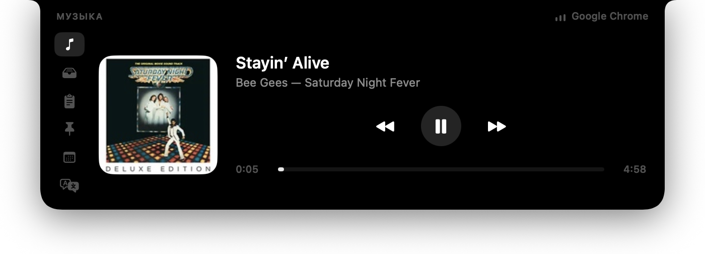

# MaadyCyclop

*[English](README.md) · Русский*

Челка MacBook как рабочая панель: навёл курсор — открылся плеер, полка, буфер, встречи и остальное. Убрал — снова только челка.



## Скачать

**[MaadyCyclop для macOS](https://github.com/NickMad17/maady-cyclop/releases/latest)** — `.dmg` на странице релиза, macOS 15 или новее.

Работает и на маке без челки: панель появляется по центру верхней кромки экрана.

## Как поставить

1. Открой `.dmg`.
2. Перетащи **MaadyCyclop** в папку **Программы**.
3. Запусти из Программ.

Первый запуск macOS остановит: «приложение не проверено». Это нормально. Разреши один раз:

**Системные настройки → Конфиденциальность и безопасность** → внизу кнопка **«Все равно открыть»**.

Или в Терминале:

```bash
xattr -dr com.apple.quarantine /Applications/MaadyCyclop.app
```

Обновление — тот же `.dmg`, перетащи поверх старого. Разрешать заново не нужно.

## Как пользоваться

Наведи курсор на челку — панель откроется. Уведи — закроется. Вкладки переключаются, если курсор на иконке задержался, а не пролетел мимо.

Иконка в меню-баре: открыть панель, автозапуск при входе, выйти.

Пока тянешь файлы к челке, панель сама открывается на полке.

| Вкладка | Что делает |
|---|---|
| **Музыка** | Обложка, трек, пауза, перемотка, следующий. Источник — что играет на маке: плеер или вкладка браузера. Ничего в браузере настраивать не нужно |
| **Полка** | Перетащил файл в челку — лежит карточкой, пока не унесёшь. Карточку можно скопировать или убрать. Снимки экрана (⌘⇧3 / ⌘⇧4 или скопированные, в том числе с айфона) сами попадают сюда и в папку `~/Pictures/MaadyCyclop`. На новом Mac ничего включать не надо |
| **Буфер** | Последние 40 копирований. Клик — снова в буфер. Пароли из менеджера паролей сюда не попадают |
| **Заготовки** | То, что надоело набирать: почта, телефон, адрес. Клик копирует |
| **Календарь** | Ближайшая встреча и кнопка войти в созвон (Zoom, Meet, Teams и другие), если ссылка есть в событии |
| **Перевод** | Пишешь слева — перевод справа, офлайн. Первый раз macOS попросит скачать языки: Настройки → Основные → Язык и регион → «Языки перевода…» |
| **Телесуфлёр** | Текст ползёт рядом с камерой. Пока он идёт, панель не закрывается |
| **Заметки** | Быстро записать и забыть. Пустые сами пропадают |

## Разрешения

Обычная работа — **без разрешений**. Не просит запись экрана, универсальный доступ и не лезет в браузер.

Календарь спросит доступ только если нажмёшь кнопку на этой вкладке. Не пользуешься — можно не давать.

Если откроешь полку с файлом из Загрузок, Документов или с Рабочего стола, macOS может спросить доступ к папке. Отказ ничего не ломает: карточка останется, без превью.

## Полезно знать

- Снимки с айфона едут через универсальный буфер: один Apple ID, Wi‑Fi, Bluetooth, Handoff, устройства рядом.
- Файлы на полке — ссылки. Переместил оригинал — карточка пропадёт. Снимки экрана — нет: они лежат в `~/Pictures/MaadyCyclop`, пока сам не почистишь папку в настройках.
- Кнопка «войти в созвон» есть, только если ссылка записана в самой встрече.
- В меню-баре можно скрыть содержимое панелей — удобно на созвоне с демонстрацией экрана.

## Для разработчиков

Собрать и открыть:

```bash
git clone https://github.com/NickMad17/maady-cyclop.git
cd maady-cyclop
./Scripts/bundle.sh
open build/MaadyCyclop.app
```

Образ: `./Scripts/dmg.sh`. Релиз: поднять номер в `Scripts/version`, написать `docs/releases/<версия>.md`, затем `./Scripts/release.sh`.

Нужны macOS 15 и Swift 6 (хватит Command Line Tools). Лицензия — MIT.
